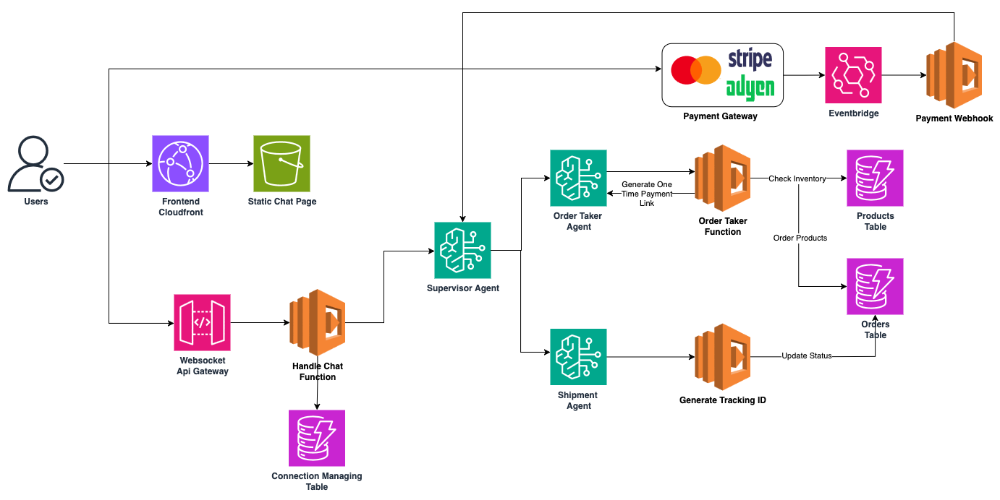
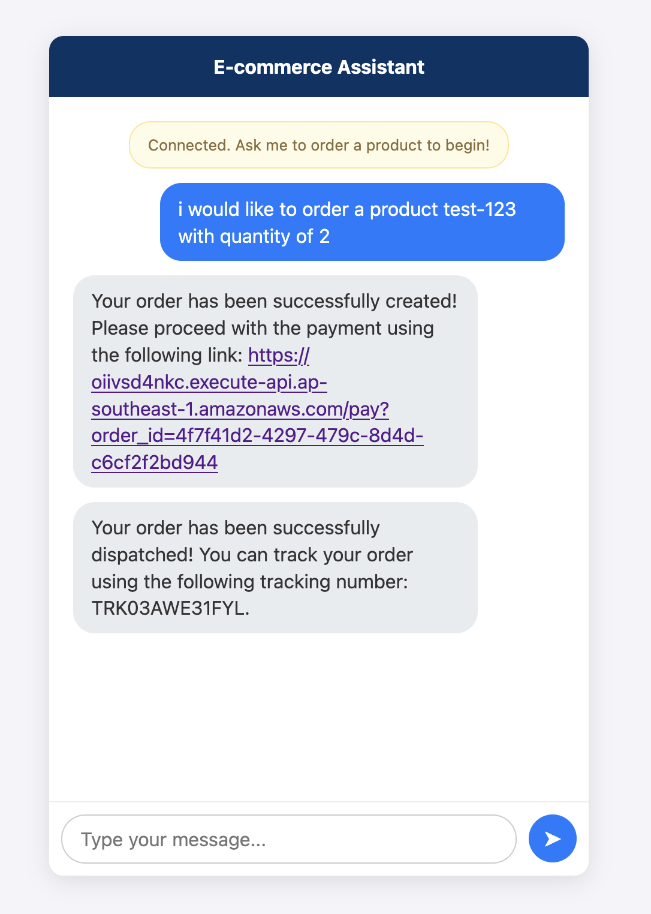

# AI-Powered E-commerce Chatbot with AWS Bedrock

A serverless e-commerce chatbot solution built on AWS, featuring AI-powered order management and automated fulfillment using Amazon Bedrock multi-agent architecture.

## Architecture Overview



This solution implements a complete e-commerce chatbot experience with the following components:

### Frontend Layer
- **CloudFront + S3**: Static website hosting for the chatbot interface
- **WebSocket API Gateway**: Real-time chat communication handling

### AI Agent Layer
- **Amazon Bedrock Supervisor Agent**: Main orchestrator for chat conversations
- **Order Management Agent**: Handles product orders and inventory
- **Shipment Agent**: Manages order fulfillment and tracking

### Backend Services
- **Lambda Functions**: Serverless compute for all business logic
- **DynamoDB**: NoSQL database for orders, inventory, and chat state
- **HTTP API Gateway**: Payment processing endpoint
- **EventBridge**: Event-driven architecture for payment notifications

## System Flow

1. **Chat Interface**: Users interact through the CloudFront-hosted static website
2. **Real-time Communication**: WebSocket API Gateway maintains persistent connections
3. **AI Conversation**: Bedrock Supervisor Agent processes chat messages and coordinates responses
4. **Order Processing**: Order Management Agent handles product selection and inventory checks
5. **Payment**: HTTP API Gateway processes payments and publishes events to EventBridge
6. **Fulfillment**: Upon payment approval, Shipment Agent initiates order fulfillment
7. **Tracking**: Users receive real-time tracking information through the chat interface

## AWS Services Used

- **Amazon Bedrock**: Multi-agent AI orchestration
- **API Gateway**: WebSocket and HTTP endpoints
- **AWS Lambda**: Serverless functions
- **Amazon DynamoDB**: Database storage
- **Amazon EventBridge**: Event routing
- **Amazon CloudFront**: CDN and static hosting
- **Amazon S3**: Static website storage

## Key Features

- Real-time chat interface with AI-powered responses
- Intelligent order management with inventory tracking
- Automated payment processing with event notifications
- Multi-agent coordination for complex workflows
- Serverless architecture for scalability and cost optimization

## Prerequisites

Before deploying this solution, ensure you have:

1. **AWS Bedrock Model Access**: Enable the following models in AWS Bedrock console:
   - **Nova Pro v1**: Used for the main AI agent orchestration
   - **Claude Instant**: Used for specific agent tasks

   Navigate to AWS Bedrock console → Model access → Request model access for the required models.

2. **AWS CLI configured** with appropriate permissions
3. **Terraform installed** (version 1.0 or later)

## Deployment Instructions

### 1. Initial Deployment
```bash
# Initialize Terraform
terraform init

# Review the deployment plan
terraform plan

# Deploy the infrastructure
terraform apply
```

### 2. Post-Deployment Configuration
After the initial deployment, you'll need to update the Lambda environment variables:

1. The API Gateway endpoint is currently commented out in the Lambda environment variables
2. After `terraform apply`, hardcode the API Gateway endpoint and run a second deployment:
   ```bash
   terraform apply
   ```

### 3. DynamoDB Product Setup
The Lambda function expects products in DynamoDB with the following schema:
- **product_id** (String): Unique identifier for the product
- **stock_level** (Number): Available inventory count

Add sample products to the DynamoDB table to test the chatbot functionality.

## Demo Payment Gateway

The current implementation includes a demo payment system using HTTP API Gateway for testing purposes. In production, this would integrate with actual payment processors.

## Output


